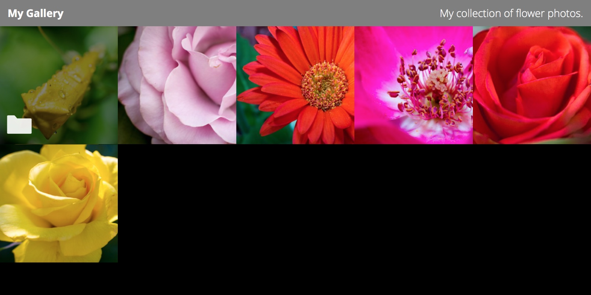

NeueGal
=======



A simple, no-database, PHP image gallery. Lightweight and lighting fast. See an installation live [here](http://nickwalker.us/work) and a custom themed one [here](http://ineswalker.com/).

Features:
* Upload over FTP. No convoluted admin interface.
* Nested folders
* Supports JPEGs and PNGs
* Gorgeous default theme lets your images shine
* Responsive; looks great on mobile
* Optional custom image descriptions and folder descriptions using text files
* Autogenerate thumbnails, or use your own custom ones (or do both at the same time)
* Fully themable...
* Or just tweakable with simple custom CSS


Installation
------

###With Composer

Add `nickswalker/neuegal` to your `composer.json`'s require section. Run `composer update`. You should now have access to `\Nickswalker\NeueGal\NeueGal`, the main class of the project. Construct a NeueGal object with a complete path to your resume.xml and some additional path parameters. Here's a base implementation that will function for an installation at the root of a server:

````php
require 'vendor/autoload.php';

$themePathFromRoot = realpath('themes/default'); //Where is your theme?
												 //Note that the theme MUST be in a publicly accesible directory!
												 //Otherwise your CSS won't load :(
$galleryPathFromRoot = realpath('Sample Gallery');

$neuegal = new \Nickswalker\NeueGal\NeueGal($themePathFromRoot, $galleryPathFromRoot);

$neuegal->display();
````

You will need to move the index.php, resume.xml, themes folder, and the Sample Gallery folder from the `vendor` directory where composer puts them into wherever you want to make your resume available, otherwise updating using `composer update` will overwrite the files. Note that the theme directory and photos directoris *must* be publicly accessible on your server. Modify the the paths in the index.php with your changes.

###Without Composer

Go to the releases tab above and download the archive of the latest release. Dowloading the source straight from GitHub *will not work* because it won't include the composer autlooad files. Unzip it into your desired install location on a server running PHP 5.3 or above enabled server and you'll be up and running.


Usage
------
###Adding Images and Files
If you don't enjoy the included gallery of flower photos (from yours truly ;) ), you can clear it out. Simply add images or folders to the directory over FTP and your gallery will update
to display them just like you'd imagine. Note however that directory information is cached and you may have to delete the
cache folder within your photos directory to get the server to update immediately.


###Adding Descriptions
Image descriptions are dynamically retrieved from a `.txt` file in your photos directory. So, to add a description to `flower.jpg`, you would create `flower.txt` in the same directory that the photo is stored in. Folder descriptions are dynamically retrieved from a `description.txt` file in a given directory.


###Overiding Dynamically Generated Thumbnails
NeueGal will generate and cache thumbnails into a cache folder within your photos directory. If you want more control, you can create your own thumbnail and upload it into the `custom thumbnails` directory within your gallery. For example, if you wanted to create a thumbnail for `mygallery/nested folder/flower.png` you would create a thumbnail at `mygallery/custom thumbnails/nested folder/flower.png`.

Settings
------

Within your theme's directory you'll find a `settings.php` file which selectively overides settings in the root settings file located in the src folder. Do not tweak settings in the root file because all changes will be overwritten during updates.


Theming
------

###"I just want to tweak some things"

Easy! Add a `custom-style.css` file to the folder where you keep your photos and it will be loaded automatically.

###"I want to write an entirely custom theme"

The default theme is an example of how flexible NeueGal is. That being said, the aim of project is to be as light weight as possible, and this means forgoing any dependencies, including a templating engine. The built in parsing and templating are not as robust as many PHP frameworks that are dedicated to that purpose, but they are _decent_.

####Getting Started

Create a folder in the themes directory. Make sure that the path to this directory is passed in when your initialize NeueGal. Create a `settings.php` and a `template.php` file in your theme's directory and you're in business.

####Changing Formatting

You can overide the HTML structure that NeueResume puts XML elements into by setting the following indexes in the settings array:

````php
return array(
    'theme' => array(
		'imageFormat' => $imageFormat,
		'folderFormat' => $folderFormat
		)
);
````

Note that you can override _any_ settings within this file (or even make up some of your own, which will become accessible through the `$settings` variable passed into your template when it is processed). The default string for the `imageFormat` index (which can be found in the root `settings.php` file) looks like this:

````html
<li>
	<a title="{{Title}} {{Description}}" class="thumb-container" href="{{Path}}" >
		
	</a>
</li>
````
Double braced words are replaced by the content of their corresponding node for the `item` being processed. The default `folderFormat` is very similar.

####Change Page Structure

The `template.php` in your theme's folder is where you can change the page as a whole. Treat it like an HTML file from which you can call into PHP for some important variables. `<?php $this->showGallery();?>` will output the images and folders of the current directory processed into your theme's specified HTML formats. You have access to any settings you've created on a `$settings` array that is passed in to the template. Additionally, you have access to some useful values on a `$vars` array. Here's a `var_dump` of `$vars` when accessing `mygallery/Nested Folder/` where the gallery root is also the document root of the server:

````php
	[current_directory] => Nested Folder/
    [gallery_url] => /
    [current_folder_name] => Nested Folder
    [description] => That's right, folders in folders
````

Look to the default theme's template for an example of how to create a cohesive structure with this information.

Issues
------

Have a bug? Please create an issue on GitHub at https://github.com/nickswalker/neuegal/issues
